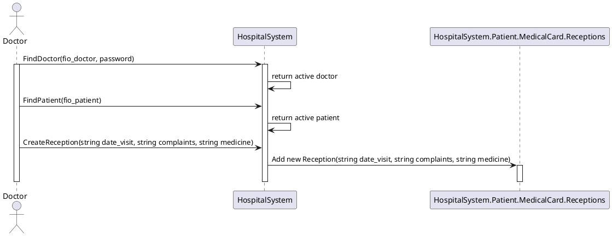

```plantuml
@startuml
actor Doctor
Doctor -> HospitalSystem : FindDoctor(fio_doctor, password)
activate Doctor
activate HospitalSystem
HospitalSystem -> HospitalSystem : return active doctor
Doctor -> HospitalSystem : FindPatient(fio_patient)
HospitalSystem -> HospitalSystem : return active patient
Doctor -> HospitalSystem : CreateReception(string date_visit, string complaints, string medicine)
HospitalSystem -> HospitalSystem.Patient.MedicalCard.Receptions : Add new Reception(string date_visit, string complaints, string medicine)
activate HospitalSystem.Patient.MedicalCard.Receptions
deactivate HospitalSystem.Patient.MedicalCard.Receptions
deactivate HospitalSystem
deactivate Doctor
@enduml
```
