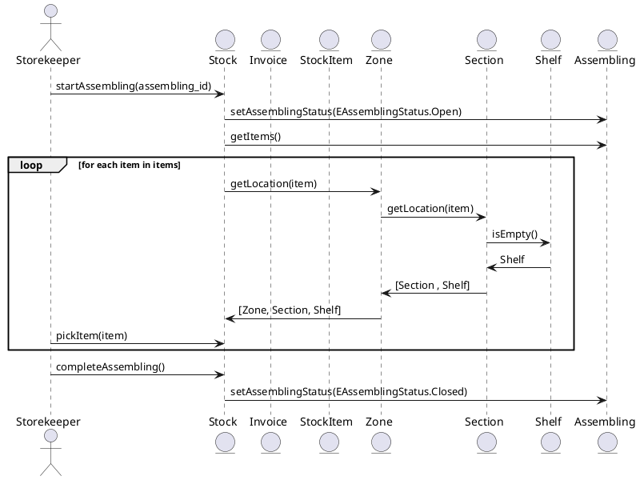

```plantuml

@startuml
actor Storekeeper
entity Stock
entity Invoice
entity StockItem
entity Zone
entity Section
entity Shelf
entity Assembling

Storekeeper -> Stock : startAssembling(assembling_id)
Stock -> Assembling : setAssemblingStatus(EAssemblingStatus.Open)
Stock -> Assembling : getItems()
loop for each item in items
    Stock -> Zone : getLocation(item)
    Zone -> Section : getLocation(item)
    Section -> Shelf : isEmpty()
    Shelf -> Section : Shelf
    Section -> Zone : [Section , Shelf]
    Zone -> Stock : [Zone, Section, Shelf]
    Storekeeper -> Stock : pickItem(item)
end
Storekeeper -> Stock : completeAssembling()
Stock -> Assembling : setAssemblingStatus(EAssemblingStatus.Closed)
@enduml


```
