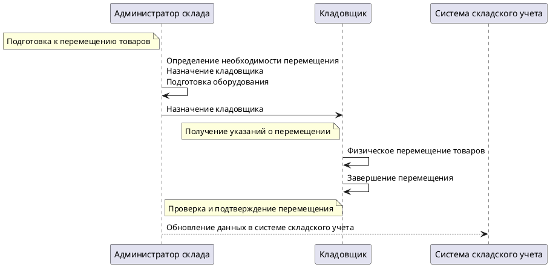

```plantuml
@startuml 1
participant "Администратор склада" as Admin
participant "Кладовщик" as Storekeeper
participant "Система складского учета" as WarehouseSystem

note left of Admin: Подготовка к перемещению товаров
Admin -> Admin: Определение необходимости перемещения\nНазначение кладовщика\nПодготовка оборудования
Admin -> Storekeeper: Назначение кладовщика
note left of Storekeeper: Получение указаний о перемещении
Storekeeper -> Storekeeper: Физическое перемещение товаров
Storekeeper -> Storekeeper: Завершение перемещения
note right of Admin: Проверка и подтверждение перемещения
Admin --> WarehouseSystem: Обновление данных в системе складского учета
@enduml
```