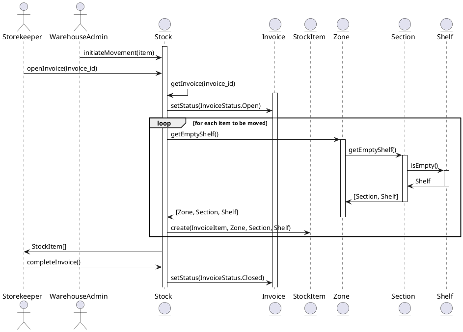

```plantuml
@startuml 
actor Storekeeper
actor WarehouseAdmin
entity Stock
entity Invoice
entity StockItem
entity Zone
entity Section
entity Shelf

activate Stock

WarehouseAdmin -> Stock : initiateMovement(item)

Storekeeper -> Stock : openInvoice(invoice_id)
Stock -> Stock : getInvoice(invoice_id)
activate Invoice
Stock -> Invoice : setStatus(InvoiceStatus.Open)


loop for each item to be moved
    Stock -> Zone : getEmptyShelf()
    activate Zone
    Zone -> Section : getEmptyShelf()
    activate Section
    Section -> Shelf : isEmpty()
    activate Shelf
    Shelf -> Section : Shelf
    deactivate Shelf
    Section -> Zone : [Section, Shelf]
    deactivate Section
    Zone -> Stock : [Zone, Section, Shelf]
    deactivate Zone
    Stock -> StockItem : create(InvoiceItem, Zone, Section, Shelf)
end
 
Stock -> Storekeeper : StockItem[]
Storekeeper -> Stock : completeInvoice()
Stock -> Invoice: setStatus(InvoiceStatus.Closed)
@enduml

```