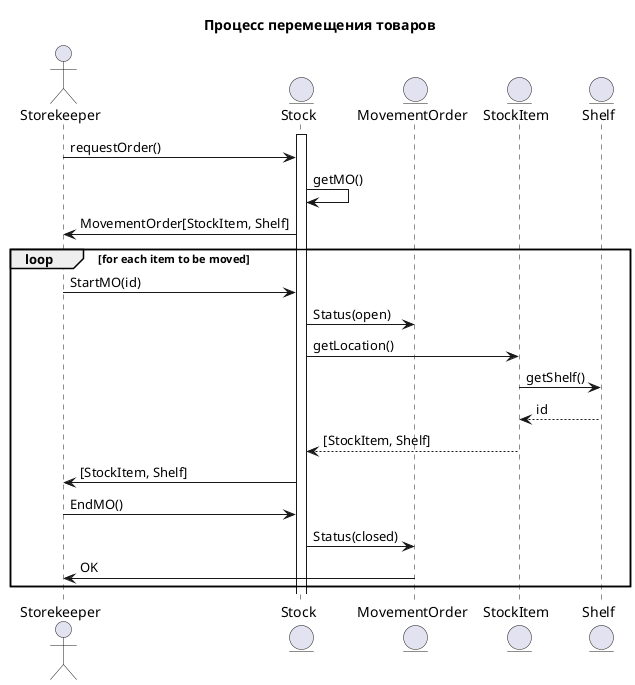

```plantuml
@startuml 
actor Storekeeper
entity Stock
entity MovementOrder
entity StockItem
entity Shelf


activate Stock
title Процесс перемещения товаров

Storekeeper -> Stock: requestOrder()
Stock -> Stock: getMO()
Stock -> Storekeeper: MovementOrder[StockItem, Shelf]

loop for each item to be moved
    Storekeeper -> Stock: StartMO(id)
    Stock -> MovementOrder: Status(open)
    Stock -> StockItem: getLocation()
    StockItem -> Shelf: getShelf()
    Shelf --> StockItem: id
    StockItem --> Stock: [StockItem, Shelf]
    Stock -> Storekeeper: [StockItem, Shelf]
    Storekeeper -> Stock: EndMO()
    Stock -> MovementOrder: Status(closed)
    MovementOrder -> Storekeeper: OK
end
@enduml


```