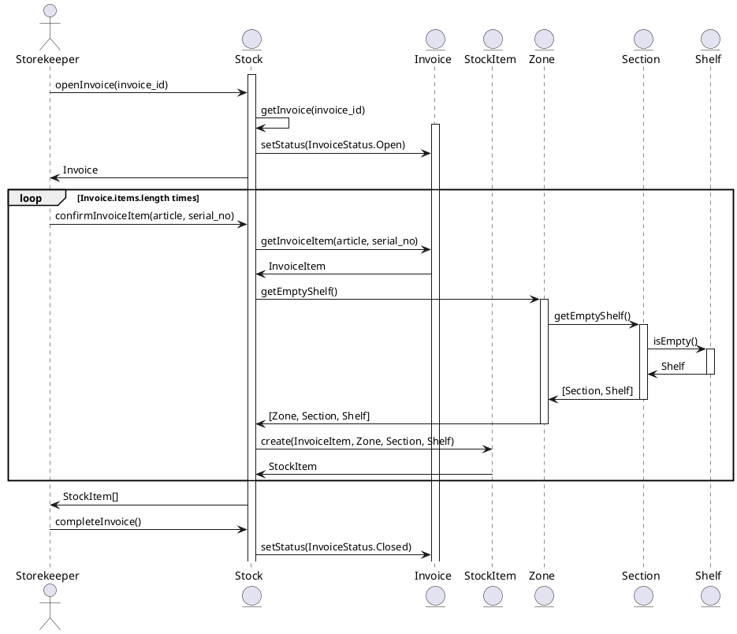

```plantuml
@startuml
actor Storekeeper
entity Stock
entity Invoice
entity StockItem
entity Zone
entity Section
entity Shelf

activate Stock

Storekeeper -> Stock : openInvoice(invoice_id)
Stock -> Stock : getInvoice(invoice_id)
activate Invoice
Stock -> Invoice : setStatus(InvoiceStatus.Open)

Stock -> Storekeeper : Invoice

loop Invoice.items.length times
    Storekeeper -> Stock : confirmInvoiceItem(article, serial_no)
    Stock -> Invoice : getInvoiceItem(article, serial_no)
    Invoice -> Stock : InvoiceItem
    Stock -> Zone : getEmptyShelf()
    activate Zone
    Zone -> Section : getEmptyShelf()
    activate Section
    Section -> Shelf : isEmpty()
    activate Shelf
    Shelf -> Section : Shelf
    deactivate Shelf
    Section -> Zone : [Section, Shelf]
    deactivate Section
    Zone -> Stock : [Zone, Section, Shelf]
    deactivate Zone
    Stock -> StockItem : create(InvoiceItem, Zone, Section, Shelf)
    StockItem -> Stock : StockItem
end

Stock -> Storekeeper : StockItem[]
Storekeeper -> Stock : completeInvoice()
Stock -> Invoice: setStatus(InvoiceStatus.Closed)

@enduml
```