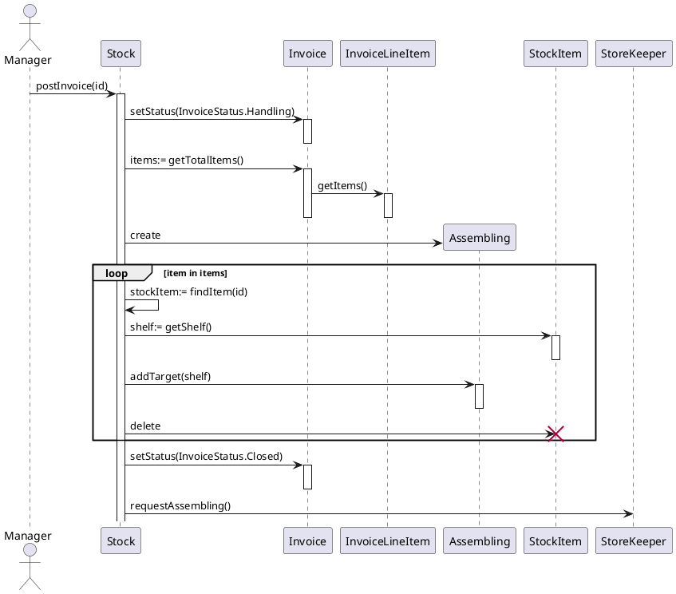

```plantuml

@startuml

actor Manager
participant Stock
participant Invoice
participant InvoiceLineItem
participant Assembling
participant StockItem
participant StoreKeeper

Manager -> Stock ++ : postInvoice(id)
Stock -> Invoice : setStatus(InvoiceStatus.Handling)
activate Invoice
deactivate Invoice
Stock -> Invoice : items:= getTotalItems()
activate Invoice
Invoice -> InvoiceLineItem : getItems()
activate InvoiceLineItem
deactivate InvoiceLineItem
deactivate Invoice
Stock -> Assembling ** : create
loop item in items
  Stock -> Stock : stockItem:= findItem(id)
  Stock -> StockItem : shelf:= getShelf()
  activate StockItem
  deactivate StockItem
  Stock -> Assembling : addTarget(shelf)
  activate Assembling
  deactivate Assembling
  Stock -> StockItem !! : delete
end
Stock -> Invoice : setStatus(InvoiceStatus.Closed) 
activate Invoice
deactivate Invoice
Stock -> StoreKeeper : requestAssembling()

@enduml

```