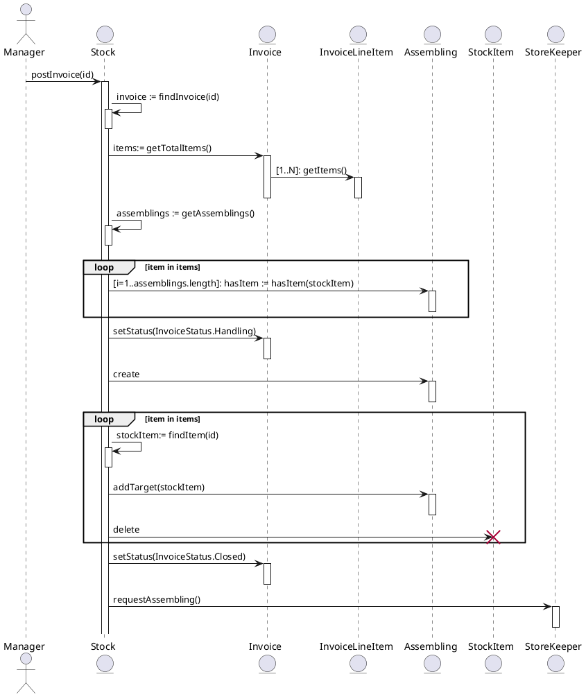

```plantuml

@startuml

actor Manager
entity Stock
entity Invoice
entity InvoiceLineItem
entity Assembling
entity StockItem
entity StoreKeeper

Manager -> Stock ++ : postInvoice(id)
Stock -> Stock ++-- : invoice := findInvoice(id)
Stock -> Invoice : items:= getTotalItems()
activate Invoice
Invoice -> InvoiceLineItem : [1..N]: getItems()
activate InvoiceLineItem
deactivate InvoiceLineItem
deactivate Invoice
Stock -> Stock ++--: assemblings := getAssemblings()
deactivate Assembling
loop item in items 
  Stock -> Assembling ++ : [i=1..assemblings.length]: hasItem := hasItem(stockItem)
  deactivate Assembling
end
Stock -> Invoice : setStatus(InvoiceStatus.Handling)
activate Invoice
deactivate Invoice
Stock -> Assembling ++ : create
deactivate Assembling
loop item in items
  Stock -> Stock ++-- : stockItem:= findItem(id)
  Stock -> Assembling : addTarget(stockItem)
  activate Assembling
  deactivate Assembling
  Stock -> StockItem !! : delete
end
Stock -> Invoice : setStatus(InvoiceStatus.Closed) 
activate Invoice
deactivate Invoice
Stock -> StoreKeeper : requestAssembling()
activate StoreKeeper
deactivate StoreKeeper

@enduml

```