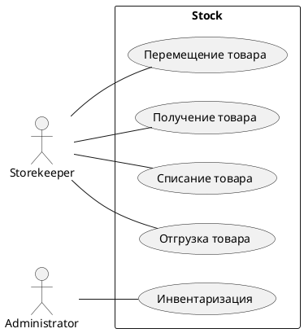

# Диаграмма прецедентов UML для Система складского учета

```plantuml
@startuml
skinparam packageStyle rect
left to right direction

:Storekeeper:
:Administrator:

package Stock {

(Получение товара)
(Инвентаризация)
(Списание товара)
(Отгрузка товара)
(Перемещение товара)

}

:Storekeeper: -- (Получение товара)
:Storekeeper: -- (Списание товара)
:Storekeeper: -- (Отгрузка товара)
:Storekeeper: -- (Перемещение товара)

:Administrator: -- (Инвентаризация)

@enduml
```
