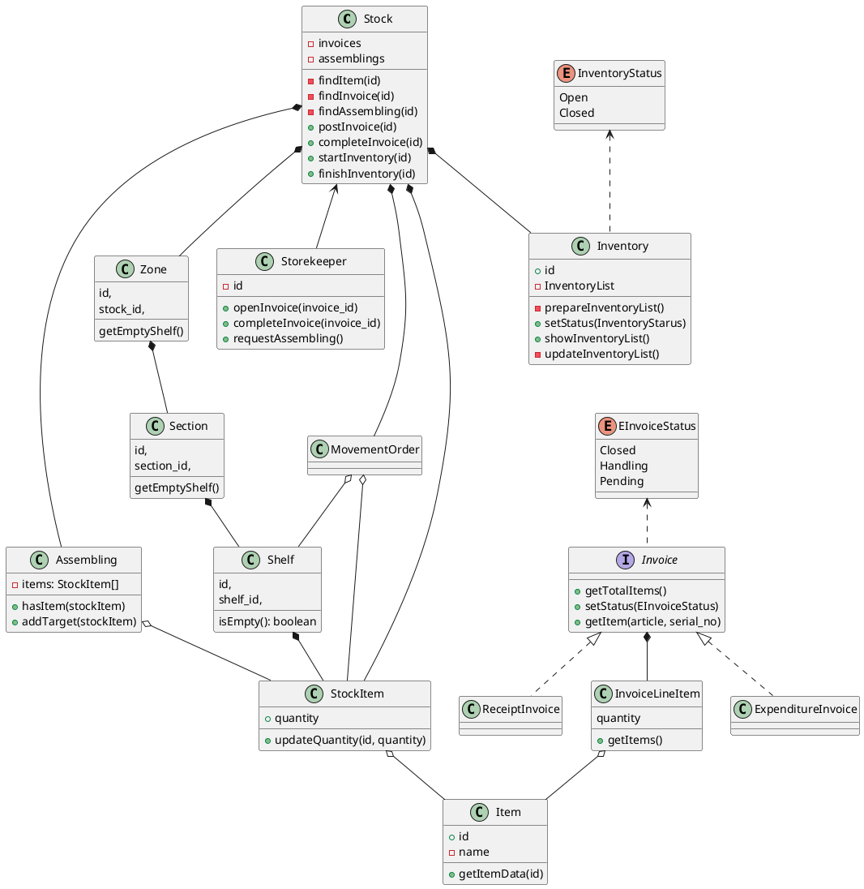

```plantuml

@startuml 

class Stock {
  -invoices
  -assemblings
  -findItem(id)
  -findInvoice(id)
  -findAssembling(id)
  +postInvoice(id)
  +completeInvoice(id)
  +startInventory(id)
  +finishInventory(id)
}

class MovementOrder {}

class Item {
  +id
  -name
  +getItemData(id)
}

class StockItem {
  +quantity
  +updateQuantity(id, quantity)
}

class Zone {
  id,
  stock_id,
  getEmptyShelf()
}

class Section {
  id,
  section_id,
  getEmptyShelf()
}

class Shelf {
  id,
  shelf_id,
  isEmpty(): boolean
}

enum EInvoiceStatus {
  Closed
  Handling
  Pending
}

interface Invoice {
  +getTotalItems()
  +setStatus(EInvoiceStatus)
  +getItem(article, serial_no)
}

class ExpenditureInvoice {}

class ReceiptInvoice {}

class InvoiceLineItem {
  quantity
  +getItems()
}

class Storekeeper {
  -id
  +openInvoice(invoice_id)
  +completeInvoice(invoice_id)
  +requestAssembling()
}

class Assembling {
  -items: StockItem[]
  +hasItem(stockItem)
  +addTarget(stockItem)
}

enum InventoryStatus {
  Open
  Closed
}

class Inventory {
  +id
  -InventoryList
  -prepareInventoryList()
  +setStatus(InventoryStarus)
  +showInventoryList()
  -updateInventoryList()
}

Stock *-- Inventory
Stock *-- MovementOrder
MovementOrder o-- StockItem
MovementOrder o-- Shelf
Invoice *-- InvoiceLineItem
InvoiceLineItem o-- Item
StockItem o-- Item
Shelf *-- StockItem
Section *-- Shelf
Zone *-- Section
Stock *-- Zone
Assembling o-- StockItem
Stock *-- Assembling
Stock <-- Storekeeper
Stock *-- StockItem
Invoice <|.. ExpenditureInvoice
Invoice <|.. ReceiptInvoice
EInvoiceStatus <.. Invoice
InventoryStatus <.. Inventory

@enduml

```
