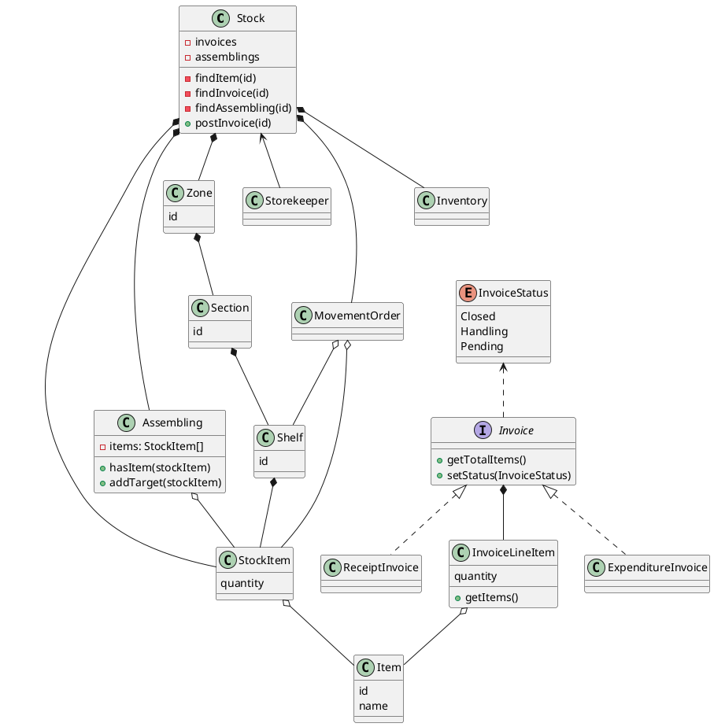

```plantuml

@startuml 

class Stock {
  -invoices
  -assemblings
  -findItem(id)
  -findInvoice(id)
  -findAssembling(id)
  +postInvoice(id)
}

class MovementOrder {}

class Item {
  id
  name
}

class StockItem {
    quantity
}

class Zone {
  id
}

class Section {
  id
}

class Shelf {
  id
}

enum InvoiceStatus {
  Closed
  Handling
  Pending
}

interface Invoice {
  +getTotalItems()
  +setStatus(InvoiceStatus)
}

class ExpenditureInvoice {}

class ReceiptInvoice {}

class InvoiceLineItem {
  quantity
  +getItems()
}

class Storekeeper {}

class Assembling {
  -items: StockItem[]
  +hasItem(stockItem)
  +addTarget(stockItem)
}


class Inventory {}

Stock *-- Inventory
Stock *-- MovementOrder
MovementOrder o-- StockItem
MovementOrder o-- Shelf
Invoice *-- InvoiceLineItem
InvoiceLineItem o-- Item
StockItem o-- Item
Shelf *-- StockItem
Section *-- Shelf
Zone *-- Section
Stock *-- Zone
Assembling o-- StockItem
Stock *-- Assembling
Stock <-- Storekeeper
Stock *-- StockItem
Invoice <|.. ExpenditureInvoice
Invoice <|.. ReceiptInvoice
InvoiceStatus <.. Invoice

@enduml

```
