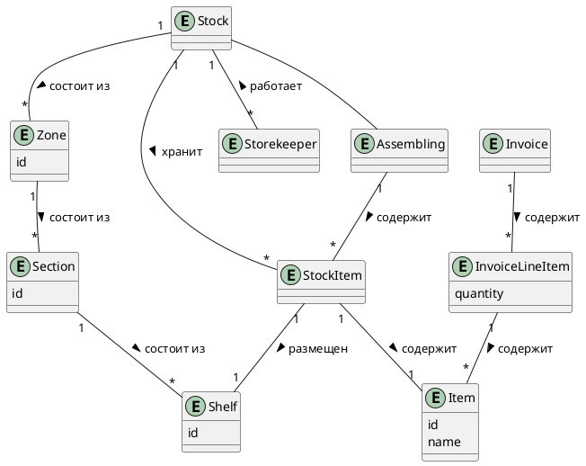

```plantuml

@startuml

entity Stock {}

entity Item {
  id
  name
}

entity StockItem {}

entity Zone {
  id
}

entity Section {
  id
}

entity Shelf {
  id
}

entity Invoice {}

entity InvoiceLineItem {
  quantity
}

entity Storekeeper {}

entity Assembling {}

Stock "1" -- "*" StockItem : "хранит >"
StockItem "1" -- "1" Item : "содержит >"
StockItem "1" -- "1" Shelf : "размещен >"
Invoice "1" -- "*" InvoiceLineItem : "содержит >"
InvoiceLineItem "1" -- "*" Item : "содержит >"
Stock "1" -- "*" Zone : "состоит из >"
Zone "1" -- "*" Section : "состоит из >"
Section "1" -- "*" Shelf : "состоит из >"
Stock "1" -- "*" Storekeeper : "работает <"
Stock -- Assembling
Assembling "1" -- "*" StockItem : "содержит >"


@enduml

```