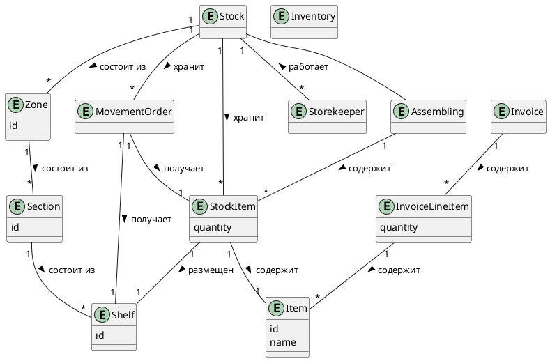

```plantuml

@startuml 

entity Stock {}

entity MovementOrder {}

entity Item {
  id
  name
}

entity StockItem {
    quantity
}

entity Zone {
  id
}

entity Section {
  id
}

entity Shelf {
  id
}

entity Invoice {}

entity InvoiceLineItem {
  quantity
}

entity Storekeeper {}

entity Assembling {}

entity Inventory {}

Stock "1" -- "*" StockItem : "хранит >"
Stock "1" -- "*" MovementOrder : "хранит >"
MovementOrder "1" -- "1" StockItem : "получает >"
MovementOrder "1" -- "1" Shelf: "получает >"
StockItem "1" -- "1" Item : "содержит >"
StockItem "1" -- "1" Shelf : "размещен >"
Invoice "1" -- "*" InvoiceLineItem : "содержит >"
InvoiceLineItem "1" -- "*" Item : "содержит >"
Stock "1" -- "*" Zone : "состоит из >"
Zone "1" -- "*" Section : "состоит из >"
Section "1" -- "*" Shelf : "состоит из >"
Stock "1" -- "*" Storekeeper : "работает <"
Stock -- Assembling
Assembling "1" -- "*" StockItem : "содержит >"

@enduml

```
